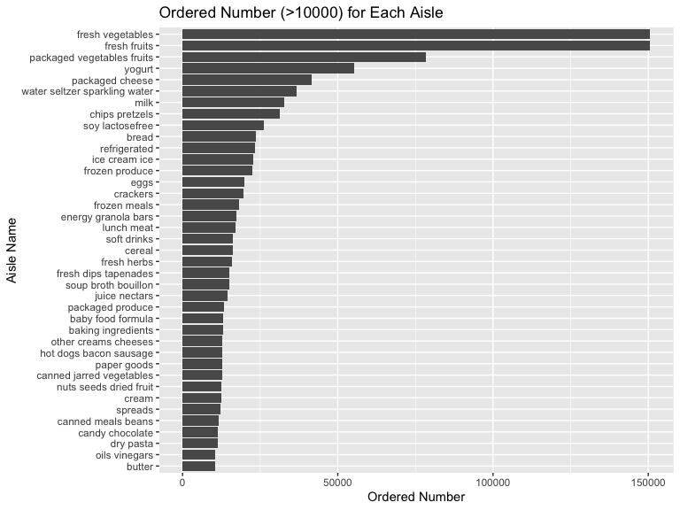

p8105\_hw3\_yw3439
================
Qetsiyah Wang
10/8/2020

## Problem 1 Instacart

``` r
library(p8105.datasets)
data("instacart")
```

The dataset instacart contains 1384617 observations and 15 variables,
order\_id, product\_id, add\_to\_cart\_order, reordered, user\_id,
eval\_set, order\_number, order\_dow, order\_hour\_of\_day,
days\_since\_prior\_order, product\_name, aisle\_id, department\_id,
aisle, department. Instacart mainly discusses about details of each
order for different customers, including order time, order quantity,
reordered condition. Order\_dow, order\_hour\_of\_day show order time
while placing each order. Reordered condition is mainly introduced in
logical variable “reordered”, order\_number and
days\_since\_prior\_order. Also, instacart introduces products
information for each order, product\_name, aisle\_id, department\_id,
aisle, department. For example, the product, yellow onions and organic
butternut squash belong to the aisle of fresh vegetables and the produce
department.

``` r
aisle = instacart %>%
  group_by(aisle) %>%
  summarize(ordered_number = n()) %>%
  arrange(-ordered_number)

aisle %>%
  filter(ordered_number > 10000) %>%
  mutate(
    aisle = fct_reorder(aisle, ordered_number)
  ) %>%
  ggplot(aes(x = ordered_number, y = aisle)) +
  geom_bar(stat = "identity", width = 0.9) +
  labs(title = "Ordered Number (>10000) for Each Aisle",
       x = "Ordered Number",
       y = "Aisle Name")
```

<!-- -->

Instacart shows that the Fresh Vegetables is the aisle that most items
ordered from, with total order of 150609. Shown in the plot “Ordered
Number (\>10000) for Each Aisle”, there are 39 aisles containing ordered
number of items more than 100000. Besides Fresh Vegetables, Fresh Fruits
show significantly high items ordered of 150473, than any else aisles.

``` r
baking = instacart %>%
  filter(aisle == "baking ingredients") %>%
  group_by(aisle, product_id, product_name) %>%
  summarize(order_number = sum(order_number)) %>%
  arrange(-order_number) %>%
  head(3)

dog = instacart %>%
  filter(aisle == "dog food care") %>%
  group_by(aisle, product_id, product_name) %>%
  summarize(order_number = sum(order_number)) %>%
  arrange(-order_number) %>%
  head(3) %>%
  full_join(baking)

most_popular_items = instacart %>%
  filter(aisle == "packaged vegetables fruits") %>%
  group_by(aisle, product_id, product_name) %>%
  summarize(order_number = sum(order_number)) %>%
  arrange(-order_number) %>%
  head(3) %>%
  full_join(dog)

knitr::kable(most_popular_items, caption = 'Three Most Popular Items for "Baking Ingredients", "Dog Food Care", "Packaged Vegetables Fruits')
```

| aisle                      | product\_id | product\_name                                 | order\_number |
| :------------------------- | ----------: | :-------------------------------------------- | ------------: |
| packaged vegetables fruits |       21903 | Organic Baby Spinach                          |        171301 |
| packaged vegetables fruits |       27966 | Organic Raspberries                           |        113932 |
| packaged vegetables fruits |       39275 | Organic Blueberries                           |         86765 |
| dog food care              |       32635 | Standard Size Pet Waste bags                  |           675 |
| dog food care              |        2574 | Beef Stew Canned Dog Food                     |           631 |
| dog food care              |         722 | Snack Sticks Chicken & Rice Recipe Dog Treats |           589 |
| baking ingredients         |       23537 | Light Brown Sugar                             |          8605 |
| baking ingredients         |       49533 | Cane Sugar                                    |          6244 |
| baking ingredients         |        7500 | Organic Vanilla Extract                       |          6003 |

Three Most Popular Items for “Baking Ingredients”, “Dog Food Care”,
"Packaged Vegetables Fruits

As shown in the table above, three most popular items for “Baking
Ingredients” are Light Brown Sugar, Cane Sugar, Organic Vanilla Extract,
with order times of 8605, 6244, 6003, respectively. For “Dog Food Care”,
three most popular items are Standard Size Pet Waste bags, Beef Stew
Canned Dog Food, Snack Sticks Chicken & Rice Recipe Dog Treats, with
order times of 675, 631, 589, respectively. For “Packaged Vegetables
Fruits”, three most popular items are Organic Baby Spinach, Organic
Raspberries, Organic Blueberries, with order times of 171301, 113932,
86765, respectively.

``` r
order_hour = instacart %>%
  select(product_name, order_dow, order_hour_of_day) %>%
  filter(product_name == "Pink Lady Apples" | product_name == "Coffee Ice Cream") %>%
  mutate(
    order_dow = as.factor(order_dow),
    order_dow = recode(order_dow, "0" = "sunday", "1" = "monday", "2" = "tuesday", "3" = "wednesday",
                       "4" = "thursday", "5" = "friday", "6" = "saturday")
    ) %>%
  group_by(product_name, order_dow) %>%
  summarize(mean_order_hour = mean(order_hour_of_day, na.rm = TRUE)) %>%
  arrange(product_name, -mean_order_hour)

fine_order_hr = order_hour %>%
  arrange(order_dow) %>%
  pivot_wider(
    names_from = order_dow,
    values_from = mean_order_hour
  )

knitr::kable(fine_order_hr, caption = 'Mean Hour of Day for Pink Lady Apples and Coffee Ice Cream')
```

| product\_name    |   sunday |   monday |  tuesday | wednesday | thursday |   friday | saturday |
| :--------------- | -------: | -------: | -------: | --------: | -------: | -------: | -------: |
| Coffee Ice Cream | 13.77419 | 14.31579 | 15.38095 |  15.31818 | 15.21739 | 12.26316 | 13.83333 |
| Pink Lady Apples | 13.44118 | 11.36000 | 11.70213 |  14.25000 | 11.55172 | 12.78431 | 11.93750 |

Mean Hour of Day for Pink Lady Apples and Coffee Ice Cream

Mean of hour of day for each week for “Pink Lady Apples” and “Coffee Ice
Cream” is shown in the table above. From the table, for “Coffee Ice
Cream”, the highest mean order hour is 15.3809524 on tuesday. “Pink Lady
Apples” shows the highest mean order hour of 14.25 on wednesday.
Generally, coffee ice cream shows higher mean order hour than pink lady
apples for 7 days within a week.

## Problem 2 Accelerometers

``` r
accel_tidy = read_csv("accel_data.csv") %>%
  janitor::clean_names() %>%
  mutate(
    day_type = rep("weekday", 35),
    day_type = ifelse(day == "Sunday"| day == "Saturday", recode(day_type, "weekday" = "weekend"), "weekday")
  ) %>%
  select(-day_id) %>%
  mutate(
    day = factor(day, levels = c("Monday", "Tuesday", "Wednesday", "Thursday", "Friday",
                                 "Saturday", "Sunday"))
  ) %>%
  pivot_longer(
    activity_1:activity_1440,
    names_to = "minute_of_the_day",
    names_prefix = "activity_",
    values_to = "activity_counts"
  ) %>%
  arrange(day)

day_activity = accel_tidy %>%
  group_by(week, day_type, day) %>%
  summarize(total_activity = sum(activity_counts))
```

Accelerometers mainly discusses the study on the physical activity of a
63 year-old male with BMI 25. The whole dataset contains 5 variables,
week, day, day\_type, minute\_of\_the\_day, activity\_counts. 1440
activity counts, for every minute of 24-hour day for total 35 days, are
all tidied into two variables, minute\_of\_the\_day and
activity\_counts, resulting final 50400 observations. Collecting
activity accounts based on days, general physical activity for this
participant is maintaining around 3.845434510^{5}. Across through the
whole study period of 35 days, there is no significant difference of his
physical activity between weekday and weekend. The maximum of the
physical activity is 3. There are two abnormal data on Saturday in week
4 and week 5, which only show 1440.

``` r
accel_tidy %>%
  mutate(
    minute_of_the_day = factor(minute_of_the_day, levels = c(1:1440), ordered = TRUE)
  ) %>%
  ggplot(aes(x = minute_of_the_day, y = activity_counts, color = day)) +
  scale_x_discrete(
    breaks = seq(1, 1440, 60),
    labels = factor(1:24)
  ) +
  geom_line() +
  labs(
    title = "24-hour Inspection Activity time courses for each day",
    x = "Time course for one 24-Hour Day",
    y = "Activity Counts"
  )
```

<!-- -->

Based on the plot, from the aspect of 24-hour time course, it is obvious
that two major parts of the physical activity for the participant are
focusing on around 12pm and 9-11pm. Before 7am, the physical activity is
lowest because this time period is sleeping time. From the aspect of
days, the physical activity on Sunday is concentrating at noon, and that
on Friday is focusing at night. For Saturday, the participant would show
mildly higher physical activity at around 5pm.

## Problem 3 NY NOAA data

``` r
library(p8105.datasets)
data("ny_noaa")
```

NY NOAA mainly presents a database about daily observations on climate
in New York City for each day, starting from 2007-11-01, containing
2595176 observations. Observations are focused on several common weather
parameters, prcp, snow, snwd, tmax, tmin, presenting precipitation,
snowfalls and temperature in NYC. Each parameter contains lots of
missing values, especially for maximum temperature that has 1134358
missing values. Generally, this dataset needs further tidy steps.

``` r
ny_climate = ny_noaa %>%
  janitor::clean_names() %>%
  separate(date, c("year", "month", "day"))
```

``` r
ny_climate = ny_climate %>%
  mutate(
    month = factor(month, levels = c("01", "02", "03", "04", "05",
                                     "06", "07", "08", "09", "10", "11", "12"), labels = month.name),
    tmax = as.numeric(tmax)/10,
    tmin = as.numeric(tmin)/10,
    prcp = prcp/10
  )

snow = ny_climate %>%
  mutate(
    snow = as.factor(snow)
  ) %>%
  group_by(snow) %>%
  summarize(count = n()) %>%
  arrange(-count)
```

Original dataset uses tenth of the unit for three paraemeters: maximum
temperature, minimum temperature and precipitation, which are all
changed into reasonable unites through being divided by 10. For
snowfalls, except missing values, the most common observed values are 0
with observations of 2008508.

``` r
ny_climate %>%
  filter(month == "January" | month =="July") %>%
  ggplot(aes(y = tmax)) +
  geom_boxplot(aes(fill = month), alpha = 0.2) +
  labs(title = "Average Temperature in January and July across Years",
       x = "Month",
       y = "Maximum Tempertaure in Degree C") +
  facet_grid(~ month)
```

<!-- -->

Shown in the plot, the average maximum temperature in July is
significantly higher than that in January, which does make sense because
July is in summer and January is in winter. The boxplot for January is
wider than the boxplot of July, meaning that the range for maximum
temperature in July is smaller than that in January. Outliers exists for
both months, which both occupies quite big proportion of the data
because the transparent filling of outliers can increase into solid
color while approaching to the average maximum temperature.

``` r
temp = ny_climate %>%
  ggplot(aes(x = tmax, y = tmin)) +
  geom_hex() +
  stat_binhex(na.rm = TRUE) +
  labs(
    title = "Maximum Temperature vs. Minimum Temperature",
    x = "Maximum Daily Temperature (C)",
    y = "Minimum Daily Temperature (C)"
  ) +
  theme(legend.position = "left")

snowfall = ny_climate %>%
  filter(snow > 0) %>%
  filter(snow < 100) %>%
  ggplot(aes(x = snow, color = year), alpha = 0.2) +
  geom_density() +
  labs(
    title = "The Distribution of Snowfall Values through Years",
    x = "Snowfalls in mm",
    y = "Density"
  ) +
  theme(legend.position = "left")
  
temp/snowfall
```

<!-- -->
